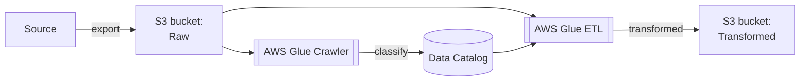

# Onboarding new datasets

Adding new datasets to the data lake usually involves three steps:

1. Add the new data to the `Raw` bucket.
2. Define a Glue Crawler to infer the schema of the new dataset.
3. Define a Glue ETL job to modify the data and write it to the `Transformed` bucket.

The flow looks like so:



Once the data is in the `Transformed` bucket, it can be connected to a tool like Superset or QuickSight for analysis.

## Add the new data

New datasets almost always start in the `Raw` bucket.  The first step is to determine the folder structure for the new dataset.  The pattern we use is below:

```
/<business-unit>/<product-name>/<database-name>/<table-name>/Partition1...PartitionN/data-files
```

---

:information_source: The only required folders are `business-unit` and `product-name`.  The remainder can be adjusted as needed by the dataset.

---

Once the folder structure has been figured out, the new dataset can be moved into the bucket.  This can be done in several different ways:

- direct S3 uploads through the console or API;
- Lambda function writes to the bucket through the API; or
- S3 replication rules to copy data between buckets.

### Define a Glue Crawler

Once the data is in the `Raw` bucket, create a Terraform pull request (PR) to do the following:

1. Define the new Glue databases that will hold the dataset's `Raw` and `Transfomred` schemas.  These are called "tables" in Glue.
1. Define the crawler that will infer the dataset's `Raw` schema.  As part of this, determine the schedule for crawler runs, which will depend on how often the `Raw` data is changing.
1. Optional: update the IAM roles and cross-account access to allow Superset to access the new dataset.

These changes can be seen in the following two PRs (note that they do not include a `Raw` Glue database):

- [cds-snc/data-lake#62](https://github.com/cds-snc/data-lake/pull/62)
- [cds-snc/cds-superset#249](https://github.com/cds-snc/cds-superset/pull/249)

---

:information_source: The naming convention for the Glue crawler should be influenced by the `Raw` bucket folder path of the dataset:
```sh
# S3 bucket path
/platform/gc-forms/forms

# Glue Crawler name
Platform / GC Forms / Forms
```

### Define a Glue ETL job

Extract, Transform, Load (ETL) jobs are used to make the raw data ready for analysis.  This includes operations like:

- joining data sources to enrich the data,
- updated column data types,
- redacting sensitive information, and
- removing data that isn't useful for analysis.

We are using [Glue Visual ETL](https://docs.aws.amazon.com/glue/latest/dg/author-job-glue.html) to create and manage our jobs in the AWS console.  [A nightly GitHub workflow](https://github.com/cds-snc/data-lake/blob/main/.github/workflows/glue_job_sync.yml) then handles synchronizing the job source back to this [GitHub repository's `/terragrunt/aws/glue/etl` folder](https://github.com/cds-snc/data-lake/tree/main/terragrunt/aws/glue/etl).

The ETL job should perform the following two tasks:

1. Write the transformed dataset to the S3 `Transformed` bucket.  The folder structure should match the dataset's `Raw` folder structure.
2. Update the dataset's Glue Catalog `Transformed` schema.

---

:warning: The Glue Catalog `Transformed` schema will be available to Superset and MUST NOT contain any protected information.
