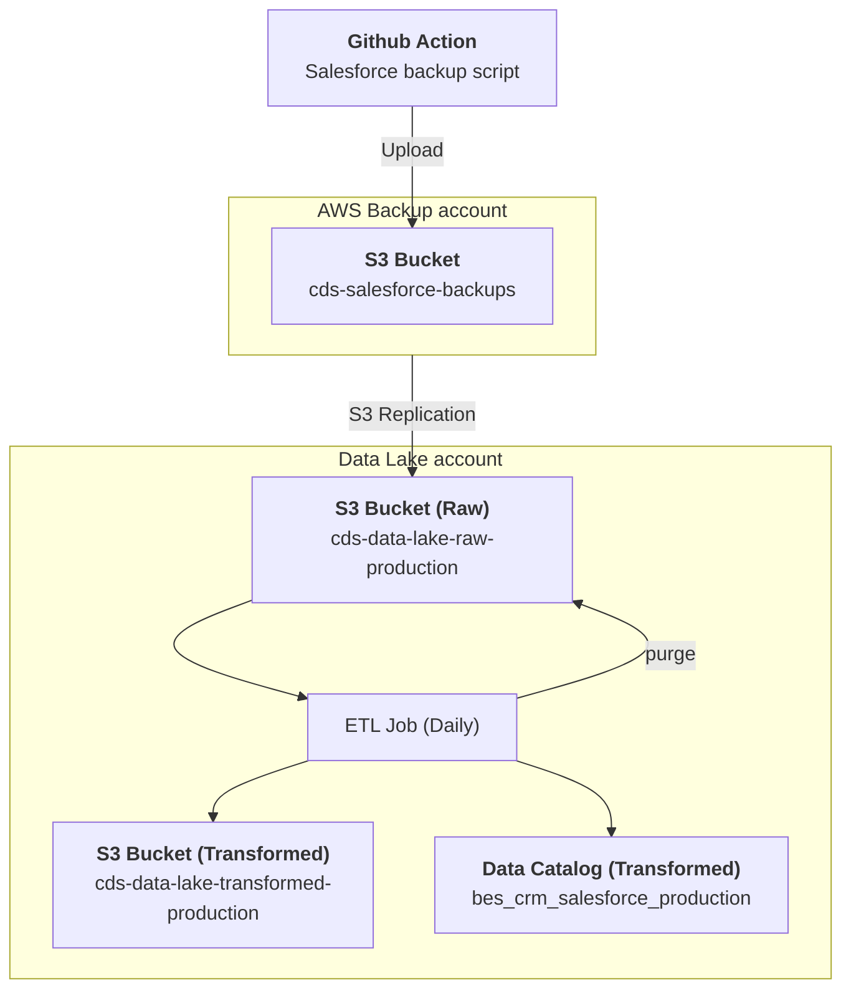

# BES / CRM / Salesforce

### :warning: Note
This dataset is still in testing and only a snapshot of Staging data is available in Superset.

* `Schedule`: Daily
* `Steward`: Platform Core Services
* `Contact`: Slack channel #platform-core-services

## Description
The [Salesforce](https://canadiandigitalservice.my.salesforce.com/) dataset provides information on customer/client/partner accounts. All user entered information and personally identifiable information (PII) has been removed from the dataset.

This data pipeline creates the Glue data catalog table `account_opportunity` in the `bes_crm_salesforce_production` database.  It can be queried in Superset as follows:

```sql
SELECT 
    * 
FROM 
    "bes_crm_salesforce_production"."account_opportunity" 
LIMIT 10;
```

---

[:information_source:  View the data catalog](../../../catalog/bes/crm/salesforce.md)

## Data pipeline
A high level view is shown below with more details about each step following the diagram.



### Source data

The [Salesforce backup script](https://github.com/cds-snc/salesforce-backup) runs as part of a [GitHub workflow](https://github.com/cds-snc/salesforce-backup/actions/workflows/salesforce-backup.yml) that is triggered daily. Each run saves multiple tables into an S3 bucket.

An S3 replication is triggered, pushing the file to the Data Lake S3 raw bucket.

```
cds-data-lake-raw-production/bes/crm/salesforce/
```

### Extract, Transform and Load (ETL) Jobs

Each day, the `BES / CRM / Salesforce` Glue ETL job runs and fetches the Salesforce raw data.  The resulting data is saved in the data lake's Transformed `cds-data-lake-transformed-production` S3 bucket:

```
cds-data-lake-transformed-production/bes/crm/salesforce/*.parquet
```

Additionally, a data catalog table is created in the `bes_crm_salesforce_production` database:

- `account_opportunity`: Salesforce accounts data with no PII
- ... more to come

Finally, the raw data is purged to prevent handling PII in the lake.
