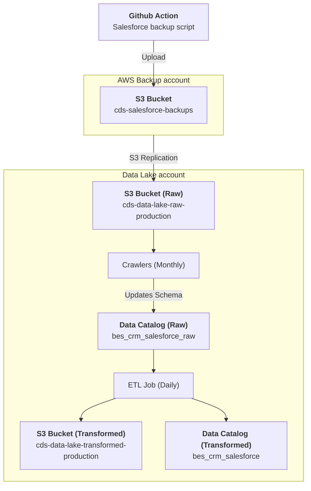

# BES / CRM / Salesforce
## Description
The [Salesforce](https://canadiandigitalservice.my.salesforce.com/) dataset provides information on customer/client/partner accounts. All user entered information and personally identifiable information (PII) has been removed from the dataset.

This data pipeline creates the Glue data catalog table `bes_crm_salesforce_account` in the `bes_crm_production` database.  It can be queried in Superset as follows:

```sql
SELECT 
    * 
FROM 
    "bes_crm_production"."bes_crm_salesforce_account" 
LIMIT 10;
```

---

[:information_source:  View the data catalog](../../../catalog/bes/crm/salesforce.md)

## Data pipeline
A high level view is shown below with more details about each step following the diagram.



### Source data

The [Salesforce backup script](https://github.com/cds-snc/salesforce-backup) runs as part of a [GitHub workflow](https://github.com/cds-snc/salesforce-backup/actions/workflows/salesforce-backup.yml) that is triggered daily. Each run saves multiple tables into an S3 bucket.

An S3 replication is triggered, pushing the file to the Data Lake S3 raw bucket.

```
cds-data-lake-raw-production/bes/crm/salesforce/
```

### Crawlers
On the first of each month, AWS Glue crawlers run in the `DataLake-Production` AWS account to identify schema changes and update the Glue data catalog:

- [BES / CRM / Salesforce](https://github.com/cds-snc/data-lake/blob/468142031c7bdd1a2720def7d5ebb4e07fff4bef/terragrunt/aws/glue/crawlers.tf)

These create and manage the following data catalog tables in the [`bes_crm_salesforce_production_raw` database](https://github.com/cds-snc/data-lake/blob/468142031c7bdd1a2720def7d5ebb4e07fff4bef/terragrunt/aws/glue/databases.tf#L6-L9):

- `bes_crm_salesforce_account`: Salesforce accounts data with no PII
- ... more to come

### Extract, Transform and Load (ETL) Jobs

Each day, the [`BES / CRM / Salesforce` Glue ETL job](https://github.com/cds-snc/data-lake/blob/6d3aea78d5d5a47d318ca66d37f0d4af6972fca4/terragrunt/aws/glue/etl.tf#L39-L108) runs and fetches the Salesforce backup tables.  The resulting data is saved in the data lake's Transformed `cds-data-lake-transformed-production` S3 bucket:

```
cds-data-lake-transformed-production/bes/crm/salesforce/*.parquet
```

Additionally, a data catalog table is created in the [`bes_crm_salesforce_production` database](https://github.com/cds-snc/data-lake/blob/6d3aea78d5d5a47d318ca66d37f0d4af6972fca4/terragrunt/aws/glue/databases.tf#L6-L9):

- `bes_crm_salesforce_account`: Salesforce accounts data with no PII
- ... more to come