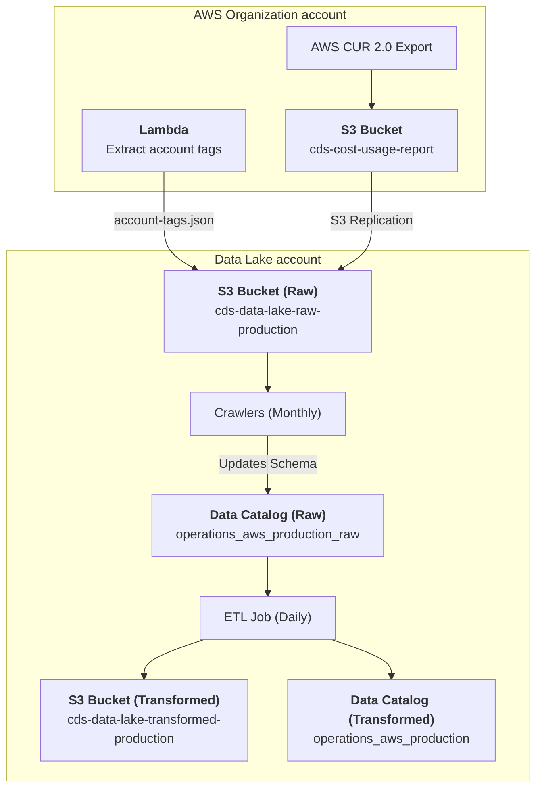

# Operations / AWS / Cost and Usage Report
## Description
The AWS [Cost and Usage Report (CUR) 2.0](https://docs.aws.amazon.com/cur/latest/userguide/what-is-cur.html) provides detailed billing data exports in  [Parquet format](https://parquet.apache.org/).  It contains line items for all AWS services usage with resource tags, pricing, and cost allocation data. The data is partitioned by time period and account ID, and updated daily.

This data pipeline creates the Glue data catalog table `cost_usage_report_by_account` in the `operations_aws_production` database.  It can be queried in Superset as follows:

```sql
SELECT 
    * 
FROM 
    "operations_aws_production"."cost_usage_report_by_account" 
LIMIT 10;
```

## Data pipeline
A high level view is shown below with more details about each step following the diagram.



### Source data
The CUR data export is configured in our AWS Organization account and written daily to the [`cds-cost-usage-report` S3 bucket in that account](https://github.com/cds-snc/cds-aws-lz/blob/8785287379159de892c255ec4d40afffee2810c1/terragrunt/org_account/cost_usage_report/s3.tf#L4-L27).  An S3 replication rule on this bucket sends the export to the [data lake's Raw `cds-data-lake-raw-production` S3 bucket](https://github.com/cds-snc/cds-aws-lz/blob/8785287379159de892c255ec4d40afffee2810c1/terragrunt/org_account/cost_usage_report/s3.tf#L15-L24):

```
cds-data-lake-raw-production/operations/aws/cost-usage-report/data/BILLING_PERIOD=YYYY-MM/*.parquet
```

Additionally, [the `billing_extract_tags` Lambda function](https://github.com/cds-snc/cds-aws-lz/blob/8785287379159de892c255ec4d40afffee2810c1/terragrunt/org_account/cost_usage_report/lambda.tf) runs each day in the AWS Organization account to retrieve all member account business unit tags and save them to the data lake's Raw bucket as well:

```
cds-data-lake-raw-production/operations/aws/organization/account-tags.json
```

### Crawlers
On the first of each month, AWS Glue crawlers run in the `DataLake-Production` AWS account to identify schema changes and update the Glue data catalog:

- [Operations / AWS / Cost and Usage Report](https://github.com/cds-snc/data-lake/blob/468142031c7bdd1a2720def7d5ebb4e07fff4bef/terragrunt/aws/glue/crawlers.tf#L24-L49)
- [Operations / AWS / Organization / Account Tags](https://github.com/cds-snc/data-lake/blob/468142031c7bdd1a2720def7d5ebb4e07fff4bef/terragrunt/aws/glue/crawlers.tf#L54-L80)

These create and manage the following data catalog tables in the [`operations_aws_production_raw` database](https://github.com/cds-snc/data-lake/blob/468142031c7bdd1a2720def7d5ebb4e07fff4bef/terragrunt/aws/glue/databases.tf#L6-L9):

- `account_tags_organization`: AWS Organization member accounts and their tag data.
- `cost_usage_report_data`: CUR 2.0 export data.
- `cost_usage_report_metadata`: CUR 2.0 export metadata, which gives details on the columns and export date.

### Extract, Transform and Load (ETL) Jobs

Each day, the [`Operations / AWS / Cost and Usage Report` Glue ETL job](https://github.com/cds-snc/data-lake/blob/468142031c7bdd1a2720def7d5ebb4e07fff4bef/terragrunt/aws/glue/etl/operations/aws/cost-and-usage-report.json) runs and joins the CUR 2.0 data with the AWS account tag data.  The resulting data is saved in the data lake's Transformed `cds-data-lake-transformed-production` S3 bucket:
```
cds-data-lake-transformed-production/operations/aws/cost-usage-report/data/billing_period=YYYY-MM/*.parquet
```

Additionally, a data catalog table is created in the [`operations_aws_production` database](https://github.com/cds-snc/data-lake/blob/468142031c7bdd1a2720def7d5ebb4e07fff4bef/terragrunt/aws/glue/databases.tf#L1-L4):

- `cost_usage_report_by_account`: CUR 2.0 export data joined with the AWS account tags.  This table is made available to users for analysis in Superset.
