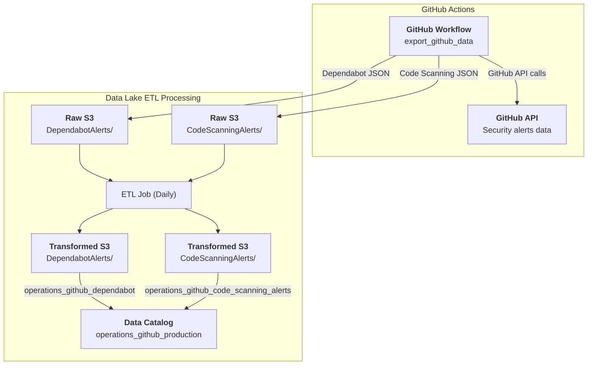

# Operations / GitHub / Metadata Alerts

* `Schedule`: Daily
* `Steward`: Platform Core Services
* `Contact`: Slack channel #platform-core-services

## Description

The GitHub metadata alerts pipeline extracts security alert data from CDS GitHub repositories using the GitHub API via the `export_github_data` GitHub workflow. It captures Dependabot vulnerability alerts and code scanning alerts to provide insights into security issues, dependency vulnerabilities, and code quality findings across the organization.

This data pipeline creates two Glue data catalog tables in the `operations_github_production` database:
- `operations_github_dependabot`: Dependabot security alerts from CDS repositories
- `operations_github_code_scanning_alerts`: Code scanning alerts from CDS repositories

The data can be queried in Superset as follows:

```sql
-- Dependabot alerts data
SELECT 
    * 
FROM 
    "operations_github_production"."operations_github_dependabot" 
LIMIT 10;

-- Code scanning alerts data
SELECT 
    * 
FROM 
    "operations_github_production"."operations_github_code_scanning_alerts" 
LIMIT 10;
```

---

[:information_source: View the data catalog](../../../catalog/operations/github/github-metadata-alerts.md)

## Data pipeline

A high level view is shown below with more details about each step following the diagram.



### Source data

The GitHub API provides comprehensive security alert metadata including:

- **Dependabot Alerts**: Vulnerability alerts for dependencies detected by GitHub's Dependabot, including CVSS scores, severity levels, CWE identifiers, and dependency information
- **Code Scanning Alerts**: Security and quality issues detected by code scanning tools (e.g., CodeQL, Semgrep), including rule severity, location information, and dismissal status

The data is extracted using the `export_github_data` GitHub workflow that makes authenticated GitHub API calls to ensure access to all CDS organization repositories. The workflow is configured with appropriate GitHub tokens and organization permissions.

Raw data is stored in the data lake's Raw `cds-data-lake-raw-production` S3 bucket:

```
cds-data-lake-raw-production/operations/github/DependabotAlerts/*.json
cds-data-lake-raw-production/operations/github/CodeScanningAlerts/*.json
```

### Crawlers

This pipeline does not use crawlers as the schema is handled directly by the ETL job. The raw JSON data is processed directly from S3 without requiring catalog tables for the raw data.

### Extract, Transform and Load (ETL) Jobs

Each day, the `Operations / GitHub / Metadata Alerts export` Glue ETL job runs and processes two parallel data streams:

**Source datasets:**
- Raw JSON files from `s3://cds-data-lake-raw-production/operations/github/DependabotAlerts/`
- Raw JSON files from `s3://cds-data-lake-raw-production/operations/github/CodeScanningAlerts/`

**Transform steps for each data stream:**
1. **JSON Array Explosion**: Explodes nested JSON arrays (`dependabot_alerts`, `code_scanning_alerts`) into individual rows, with one row per alert
2. **Alert Flattening**: Flattens complex nested alert objects containing metadata, severity, location, and other properties into top-level fields
3. **CWE Explosion** (Dependabot only): Further explodes CWE array to create separate rows for each CWE associated with a vulnerability
4. **Schema Mapping**: Maps and transforms field types appropriately for numeric and temporal data
5. **Metadata Cleaning**: Drops intermediate columns like `metadata_query` and array fields that are not needed in final output

**Target datasets:**
The transformed data is saved in the data lake's Transformed `cds-data-lake-transformed-production` S3 bucket:

```
cds-data-lake-transformed-production/operations/github/DepndabotAlerts/*.parquet
cds-data-lake-transformed-production/operations/github/CodeScanningAlerts/*.parquet
```

Additionally, data catalog tables are created in the `operations_github_production` database:

- `operations_github_dependabot`: Processed Dependabot alert data with flattened vulnerability information and CWE details, available for analysis in Superset
- `operations_github_code_scanning_alerts`: Processed code scanning alert data with flattened rule and location information, available for analysis in Superset

**Run frequency:** Daily to capture the latest security alerts

