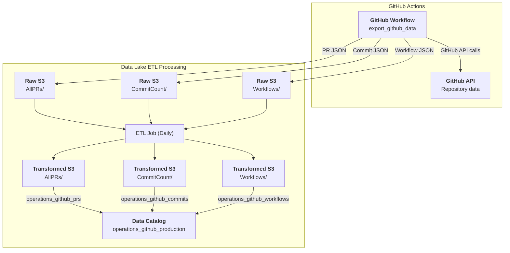

# Operations / GitHub / GitHub Metadata

* `Schedule`: Daily
* `Steward`: Platform Core Services
* `Contact`: Slack channel #platform-core-services

## Description

The GitHub metadata pipeline extracts repository activity data from CDS GitHub repositories using the GitHub API via the `export_github_data` GitHub workflow. It captures pull request information and commit history to provide insights into development activity, code contributions, and repository health across the organization.

This data pipeline creates three Glue data catalog tables in the `operations_github_production` database:
- `operations_github_prs`: Pull request metadata from CDS repositories
- `operations_github_commits`: Commit history and author information
- `operations_github_workflows`: GitHub Actions workflow run data

The data can be queried in Superset as follows:

```sql
-- Pull requests data
SELECT 
    * 
FROM 
    "operations_github_production"."operations_github_prs" 
LIMIT 10;

-- Commits data
SELECT 
    * 
FROM 
    "operations_github_production"."operations_github_commits" 
LIMIT 10;

-- Workflow data
SELECT 
    * 
FROM 
    "operations_github_production"."operations_github_workflows" 
LIMIT 10;
```

---

[:information_source:  View the data catalog](../../../catalog/operations/github/github-metadata.md)

## Data pipeline

A high level view is shown below with more details about each step following the diagram.



### Source data

The GitHub API provides comprehensive repository metadata including:

- **Pull Requests**: All pull request data from monitored CDS repositories, including creation dates, merge status, author information, and review activity
- **Commits**: Git commit history including author information, timestamps, verification status, and commit metadata
- **Workflows**: GitHub Actions workflow run data including status, conclusions, and execution details

The data is extracted using the `export_github_data` GitHub workflow that makes authenticated GitHub API calls to ensure access to all CDS organization repositories. The workflow is configured with appropriate GitHub tokens and organization permissions.

Raw data is stored in the data lake's Raw `cds-data-lake-raw-production` S3 bucket:

```
cds-data-lake-raw-production/operations/github/AllPRs/*.json
cds-data-lake-raw-production/operations/github/CommitCount/*.json
cds-data-lake-raw-production/operations/github/Workflows/*.json
```

### Crawlers

This pipeline does not use crawlers as the schema is handled directly by the ETL job. The raw JSON data is processed directly from S3 without requiring catalog tables for the raw data.

### Extract, Transform and Load (ETL) Jobs

Each day, the `Operations / GitHub / Metadata export` Glue ETL job runs and processes three parallel data streams:

**Source datasets:**
- Raw JSON files from `s3://cds-data-lake-raw-production/operations/github/AllPRs/`
- Raw JSON files from `s3://cds-data-lake-raw-production/operations/github/CommitCount/`
- Raw JSON files from `s3://cds-data-lake-raw-production/operations/github/Workflows/`

**Transform steps for each data stream:**
1. **JSON Array Explosion**: Explodes nested JSON arrays (`prs`, `commit_count`, `workflows`) into individual rows
2. **Schema Mapping**: Maps and transforms field types (e.g., `bigint` to `long`)
3. **Schema Flattening**: Flattens complex nested objects into top-level fields
4. **Metadata Cleaning**: Drops intermediate columns like `metadata_query` that are not needed in final output

**Target datasets:**
The transformed data is saved in the data lake's Transformed `cds-data-lake-transformed-production` S3 bucket:

```
cds-data-lake-transformed-production/operations/github/AllPRs/*.parquet
cds-data-lake-transformed-production/operations/github/CommitCount/*.parquet
cds-data-lake-transformed-production/operations/github/Workflows/*.parquet
```

Additionally, data catalog tables are created in the `operations_github_production` database:

- `operations_github_prs`: Processed pull request data with flattened structure, available for analysis in Superset
- `operations_github_commits`: Processed commit data with author and verification information, available for analysis in Superset
- `operations_github_workflows`: Processed workflow run data with status and conclusion information, available for analysis in Superset

**Run frequency:** Daily to capture the latest repository activity
