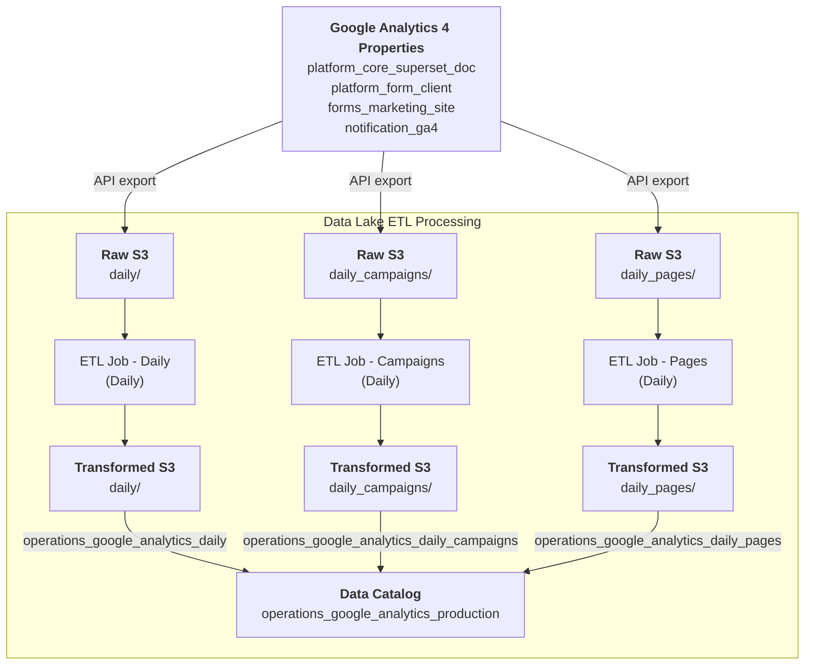

# Operations / Google Analytics

* `Schedule`: Daily
* `Steward`: Platform Core Services
* `Contact`: Slack channel #platform-core-services

## Description

The Google Analytics pipeline extracts web traffic metrics from multiple CDS web properties using the Google Analytics Reporting API. It captures daily aggregated analytics metrics including sessions, active users, bounce rates, and engagement metrics, optionally broken down by campaign and page dimensions.

This data pipeline creates three Glue data catalog tables in the `operations_google_analytics_production` database:
- `operations_google_analytics_daily`: Overall property-level analytics metrics
- `operations_google_analytics_daily_campaigns`: Campaign-level performance metrics
- `operations_google_analytics_daily_pages`: Page-level performance metrics

The data can be queried in Superset as follows:

```sql
-- Daily aggregated analytics
SELECT 
    * 
FROM 
    "operations_google_analytics_production"."operations_google_analytics_daily" 
LIMIT 10;

-- Campaign performance
SELECT 
    * 
FROM 
    "operations_google_analytics_production"."operations_google_analytics_daily_campaigns" 
LIMIT 10;

-- Page performance
SELECT 
    * 
FROM 
    "operations_google_analytics_production"."operations_google_analytics_daily_pages" 
LIMIT 10;
```

---

[:information_source: View the data catalog](../../../catalog/operations/googleanalytics/google-analytics.md)

## Data pipeline

A high level view is shown below with more details about each step following the diagram.



### Source data

The Google Analytics 4 API provides web traffic metrics for four separate CDS web properties:

- **platform_core_superset_doc**: Superset documentation and analytics platform
- **platform_form_client**: GC Forms client application
- **forms_marketing_site**: Forms marketing website
- **notification_ga4**: Notification service analytics

The data is extracted daily from each GA property using the Google Analytics Reporting API. Metrics include:
- Session counts and active user numbers
- Bounce rates indicating engagement quality
- User engagement duration showing time spent
- Campaign attribution for marketing performance
- Page-level performance metrics for specific content

Raw data is stored in the data lake's Raw `cds-data-lake-raw-production` S3 bucket, organized by property and metric dimension:

```
cds-data-lake-raw-production/operations/google-analytics/[property]/daily/*.json
cds-data-lake-raw-production/operations/google-analytics/[property]/daily_campaigns/*.json
cds-data-lake-raw-production/operations/google-analytics/[property]/daily_pages/*.json
```

### Crawlers

This pipeline does not use crawlers as the schema is handled directly by the ETL jobs. The raw JSON data is processed directly from S3 without requiring catalog tables for the raw data.

### Extract, Transform and Load (ETL) Jobs

Three separate daily Glue ETL jobs run to process different metric dimensions:

#### Job 1: Daily Aggregated Metrics (`Operations / GoogleAnalytics / Daily`)

**Source datasets:**
- Raw JSON files from all four GA properties in `daily/` paths

**Transform steps:**
1. **Multi-Property Consolidation**: Reads data from all four GA properties
2. **Date Normalization**: Converts date format from YYYYMMDD to YYYY-MM-DD
3. **Type Casting**: Converts string representations to appropriate numeric types:
   - `sessions` → integer
   - `activeusers` → integer
   - `bouncerate` → double
   - `userengagementduration` → integer
4. **Null Handling**: Converts empty strings to null values for cleaner data
5. **Property Tagging**: Adds `ga_property` field to identify source GA property
6. **Schema Standardization**: Normalizes field names to camelCase

**Target dataset:**
```
cds-data-lake-transformed-production/operations/google-analytics/daily/*.parquet
```

Table: `operations_google_analytics_daily` in `operations_google_analytics_production` database

#### Job 2: Campaign Performance (`Operations / GoogleAnalytics / DailyCampaigns`)

**Source datasets:**
- Raw JSON files from all four GA properties in `daily_campaigns/` paths

**Transform steps:**
1. **Multi-Property Consolidation**: Reads campaign data from all four GA properties
2. **Date Normalization**: Converts date format from YYYYMMDD to YYYY-MM-DD
3. **Type Casting**: Converts string representations to appropriate numeric types:
   - `sessions` → integer
   - `activeusers` → integer
4. **Campaign Filtering**: Includes only rows with campaign attribution data
5. **Property Tagging**: Adds `ga_property` field to identify source GA property
6. **Schema Standardization**: Normalizes field names to camelCase

**Target dataset:**
```
cds-data-lake-transformed-production/operations/google-analytics/daily_campaigns/*.parquet
```

Table: `operations_google_analytics_daily_campaigns` in `operations_google_analytics_production` database

#### Job 3: Page Performance (`Operations / GoogleAnalytics / DailyPages`)

**Source datasets:**
- Raw JSON files from all four GA properties in `daily_pages/` paths

**Transform steps:**
1. **Multi-Property Consolidation**: Reads page-level data from all four GA properties
2. **Date Normalization**: Converts date format from YYYYMMDD to YYYY-MM-DD
3. **Type Casting**: Converts string representations to appropriate numeric types:
   - `sessions` → integer
   - `activeusers` → integer
   - `bouncerate` → double
   - `userengagementduration` → integer
4. **Page Filtering**: Includes only rows with page title data
5. **Property Tagging**: Adds `ga_property` field to identify source GA property
6. **Schema Standardization**: Normalizes field names to camelCase and preserves page title

**Target dataset:**
```
cds-data-lake-transformed-production/operations/google-analytics/daily_pages/*.parquet
```

Table: `operations_google_analytics_daily_pages` in `operations_google_analytics_production` database

**Run frequency:** Daily to capture the latest web traffic metrics

