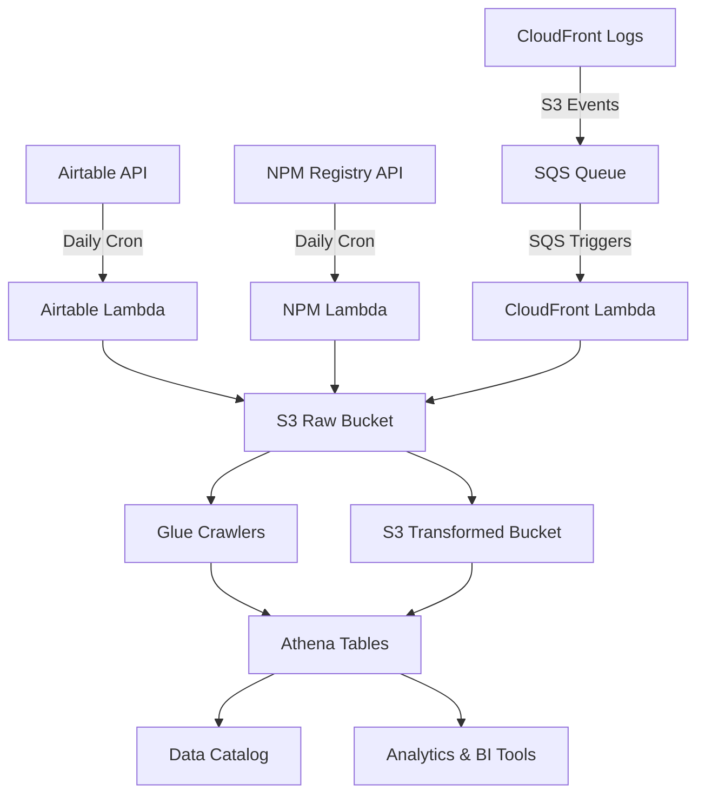

# GC Design System Pipelines

## Overview
This directory contains technical documentation for all data pipelines that collect, process, and store GC Design System related data.

## Pipeline Architecture

### Processing Models
The GC Design System uses two distinct processing patterns:

#### Scheduled Processing
- **Pipelines**: [Airtable](./airtable.md), [NPM](./npm.md)
- **Trigger**: Daily cron schedule (6:00 AM UTC)
- **Pattern**: Lambda function → S3 storage → Glue crawler schema update
- **Use Case**: Batch processing of external API data

#### Event-Driven Processing with SQS
- **Pipelines**: [CloudFront](./cloudfront.md)
- **Trigger**: S3 ObjectCreated events → SQS queue → Lambda processing
- **Pattern**: S3 upload → SQS buffering → Immediate Lambda processing
- **Use Case**: Event-driven log processing with SQS buffering for reliability

### Infrastructure Components

#### Lambda Functions
| Function | Runtime | Timeout | Trigger | Purpose |
|----------|---------|---------|---------|---------|
| `platform-gc-design-system-export` | Python 3.13 ARM64 | 5 min | Scheduled | Airtable data export |
| `platform-gc-design-system-npm-export` | Python 3.13 ARM64 | 5 min | Scheduled | NPM statistics collection |
| `platform-gc-design-system-cloudfront-export` | Python 3.13 ARM64 | 15 min | SQS Event | CloudFront log processing |

#### Glue Crawlers
| Crawler | Schedule | Purpose |
|---------|----------|---------|
| `platform-gc-design-system-airtable` | Daily 6:00 AM UTC | Airtable schema discovery |
| `platform-gc-design-system-npm` | Manual (triggered by Lambda) | NPM data schema update |
| `platform-gc-design-system-cloudfront` | Triggered by Lambda | CloudFront schema discovery |

#### S3 Storage Structure
```
Raw Bucket:
├── platform/gc-design-system/airtable/
├── platform/gc-design-system/npm/
└── platform/gc-design-system/cloudfront-logs/     # CloudFront logs (input)

Transformed Bucket:
├── platform/gc-design-system/airtable/
├── platform/gc-design-system/npm/
└── platform/gc-design-system/cloudfront-logs/     # Processed logs (output)
```

## Pipeline Details

### [Airtable Export Pipeline](./airtable.md)
Collects client and department data from Airtable API.
- **Data Source**: Airtable API (design system base)
- **Processing**: JSON transformation and metadata enrichment
- **Output**: Structured client data with timestamps

### [NPM Statistics Pipeline](./npm.md)
Fetches download statistics for GC Design System NPM packages.
- **Data Source**: NPM Registry API
- **Processing**: Yearly aggregation and trend analysis
- **Output**: Download counts by time period

### [CloudFront Log Processing Pipeline](./cloudfront.md)
Event-driven processing of CloudFront access logs with SQS reliability.
- **Data Source**: CloudFront log files (.gz format)
- **Processing**: Real-time processing via SQS event triggers
- **Output**: Parquet files with Hive-style partitioning
- **Processing**: Log parsing, decompression, and enrichment
- **Output**: Structured access log data in Parquet format with geographic and performance metrics

## Deployment

### CI/CD Integration
All pipelines are integrated with GitHub Actions workflows:
- **Docker Build**: Automated container builds for both staging and production
- **Infrastructure**: Terraform/Terragrunt deployment via GitHub Actions
- **Matrix Strategy**: Parallel builds for all three export functions

### Environment Configuration
- **Staging**: `terragrunt/env/staging/export/`
- **Production**: `terragrunt/env/production/export/`
- **Dependencies**: S3 buckets, Glue crawlers, SNS alarms

## Monitoring and Alerting

### CloudWatch Metrics
- Lambda execution duration and error rates
- S3 event processing latency
- Glue crawler execution status

### Error Handling
- **Fail-fast**: Functions exit immediately on critical errors
- **Logging**: Comprehensive error logging via CloudWatch
- **Isolation**: Individual pipeline failures don't affect other services

## Data Flow



## Development

### Local Development
Each pipeline includes:
- `main.py` - Lambda function entry point
- `main_test.py` - Unit tests with mocking
- `requirements.txt` - Python dependencies
- `Dockerfile` - Container configuration
- `Makefile` - Development commands

### Testing
```bash
# Run tests for all pipelines
make test-airtable
make test-npm  
make test-cloudfront

# Build containers locally
make build-airtable
make build-npm
make build-cloudfront
```

### Adding New Pipelines
1. Create new subdirectory under `/export/platform/gc_design_system/`
2. Implement Lambda function following existing patterns
3. Add Terraform configuration in `lambda.tf`
4. Update Glue crawler configuration if needed
5. Add to CI/CD workflows
6. Create documentation following this template

## Troubleshooting

### Common Issues
- **API Rate Limits**: NPM and Airtable APIs have rate limiting
- **SQS Message Retention**: CloudFront events are queued for up to 6 hours before processing
- **Batch Processing Delays**: Log data may have up to 6-hour processing delay
- **Schema Changes**: Glue crawlers may need manual runs after source changes

### Debugging Commands
```bash
# Check Lambda logs
aws logs tail /aws/lambda/platform-gc-design-system-export

# Check S3 trigger configuration
aws s3api get-bucket-notification-configuration --bucket <bucket-name>

# Validate Glue crawler status
aws glue get-crawler --name platform-gc-design-system-cloudfront
```

## Contact
For technical questions or pipeline issues, contact the Data Lake infrastructure team.
