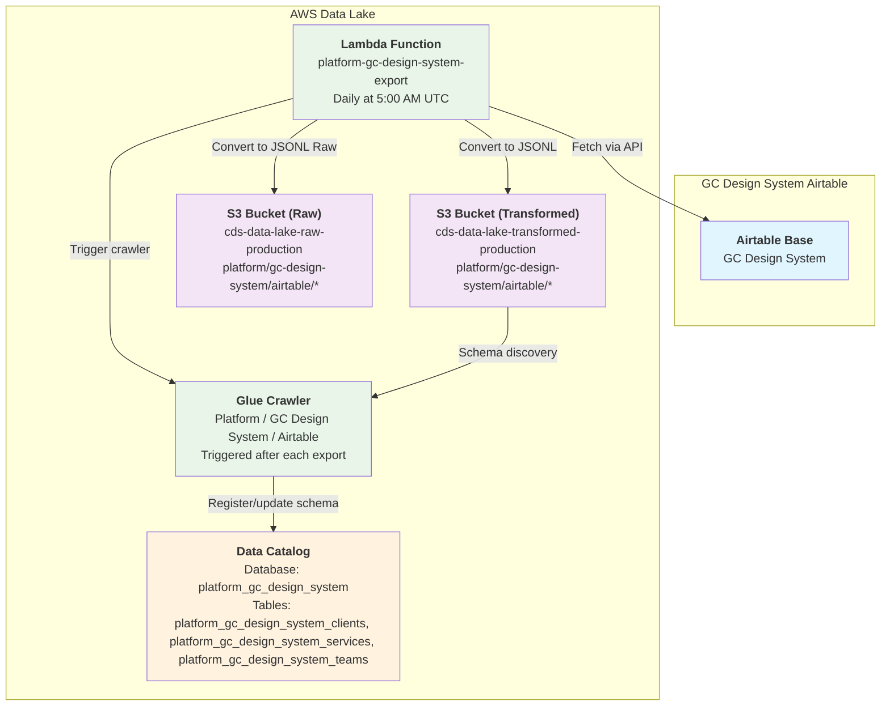

# Platform / GC Design System / Airtable

* `Schedule`: Daily at 5:00 AM UTC (Production only)
* `Steward`: GC Design System
* `Contact`: Slack channel #ds-cds-internal

## Description

The GC Design System Airtable dataset is an export of design component data from the GC Design System Airtable base in [JSONL format](https://jsonlines.org/). This dataset contains information about design components, their properties, usage guidelines, and related metadata that powers the Government of Canada Design System.

The data is exported daily from Airtable and automatically registered as a queryable table in the data catalog.

## Data pipeline

The pipeline uses a scheduled Lambda function to extract data from Airtable and automatically register it for querying in Athena.

## Technical Details

### Data Source
- **Source System**: Airtable
- **Authentication**: Bearer token stored in SSM Parameter Store
- **API Endpoint**: `https://api.airtable.com/v0/{base_id}/{table_name}`

### Export Process
1. **Scheduled Trigger**: CloudWatch Events rule triggers Lambda daily at 5:00 AM UTC (Production only)
2. **Data Extraction**: Lambda function fetches all records from Airtable API with pagination support
3. **Data Transformation**: Raw JSON records are converted to JSONL format for efficient querying
4. **Storage**: Data is uploaded to S3 in the transformed bucket under `platform/gc-design-system/airtable/`
5. **Schema Registration**: Glue crawler is automatically triggered to update the table schema in the data catalog

### Infrastructure Components

#### Lambda Function
- **Name**: `platform-gc-design-system-export`
- **Runtime**: Python (ARM64 architecture)
- **Timeout**: 300 seconds
- **Memory**: Default
- **Environment Variables**:
    - `AIRTABLE_API_KEY_PARAMETER_NAME`: SSM parameter name for API key
    - `S3_BUCKET_NAME`: Target S3 bucket name
    - `S3_OBJECT_PREFIX`: S3 path prefix for data files
    - `AIRTABLE_BASE_ID`: Airtable base identifier
    - `AIRTABLE_TABLE_NAME_CLIENTS`: Airtable table identifier for clients
    - `AIRTABLE_TABLE_NAME_TEAMS`: Airtable table identifier for teams
    - `AIRTABLE_TABLE_NAME_SERVICES`: Airtable table identifier for services

#### IAM Permissions
- **SSM**: Read access to Airtable API key parameter
- **S3**: Write access to transformed bucket path
- **Glue**: Start and monitor crawler execution

#### Glue Crawler
- **Name**: `platform-gc-design-system-airtable-crawler`
- **Target**: S3 path in transformed bucket
- **Database**: `platform_gc_design_system`
- **Table Prefix**: `platform_gc_design_system_`
- **Schedule**: Triggered by Lambda after each data export
- **Schema Policy**: Update schema changes, merge new columns

### Data Format
- **File Format**: JSONL (JSON Lines)
- **Compression**: None
- **Partitioning**: None (single file per export)
- **Update Frequency**: Daily (overwrites previous data)

### Monitoring
- **CloudWatch Logs**: Lambda execution logs available in `/aws/lambda/platform-gc-design-system-export`
- **Glue Crawler Logs**: Available in CloudWatch under `/aws-glue/crawlers`
- **Failure Notifications**: Configured through existing alarm infrastructure

## Data Schema

The table schema is automatically discovered by the Glue crawler based on the JSON structure from Airtable. Common fields typically include:

- `id`: Unique record identifier from Airtable
- `createdTime`: Timestamp when record was created in Airtable
- `fields`: Object containing all the custom fields defined in the Airtable table

*Note: The exact schema depends on the current structure of the Airtable table and will be automatically updated by the crawler when changes are detected.*

## Access and Permissions

- **Data Location**: S3 bucket `cds-data-lake-transformed-production`
- **Query Access**: Available through AWS Athena
- **Visualization**: Can be connected to Apache Superset for dashboards
- **API Access**: Raw data available via Airtable API (requires separate authentication)

## Troubleshooting

### Common Issues
1. **Lambda Timeout**: If Airtable table grows large, increase Lambda timeout
2. **API Rate Limits**: Function includes rate limiting; monitor for 429 errors
3. **Schema Changes**: Crawler automatically detects schema changes, but manual intervention may be needed for major structural changes
4. **Access Denied**: Verify SSM parameter exists and Lambda has proper IAM permissions

### Support
For issues with this pipeline, contact the Platform Core Services team via the #platform-core-services Slack channel.
