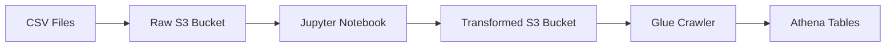

```mermaid
graph TD
    %% Source Data
    Analytics["`**Analytics CSV Files**<br/>Weekly aggregated statistics`"]
    
    %% Storage
    RawS3["`**S3 Bucket (Raw)**<br/>cds-data-lake-raw-production<br/>platform/gc-design-system/cloudfront-historical-data/`"]
    TransS3["`**S3 Bucket (Transformed)**<br/>cds-data-lake-transformed-production<br/>platform/gc-design-system/cloudfront-historical-data/`"]
    
    %% Processing
    Notebook["`**Jupyter Notebook**<br/>Local processing<br/>Data validation & formatting`"]
    Crawler["`**Glue Crawler**<br/>platform-gc-design-system-cloudfront-historical<br/>Schema registration`"]
    
    %% Catalog
    CatalogHistory["`**Data Catalog**<br/>Database: platform_gc_design_system<br/>Tables: popular_objects_history, top_referrers_history`"]

    %% Flow
    subgraph manual_process[Manual Processing Workflow]
        Analytics --> |Manual upload|RawS3
        RawS3 --> |Download for processing|Notebook
        Notebook --> |Manual upload|TransS3
        TransS3 --> |Manual trigger|Crawler
        Crawler --> |Schema discovery|CatalogHistory
    end

    %% Styling
    classDef source fill:#e1f5fe
    classDef storage fill:#f3e5f5
    classDef processing fill:#e8f5e8
    classDef catalog fill:#fff3e0

    class Analytics source
    class RawS3,TransS3 storage
    class Notebook,Crawler processing
    class CatalogHistory catalog
```

# Platform / GC Design System / CloudFront Historical Analytics

* `Schedule`: Manual processing
* `Steward`: GC Design System
* `Contact`: Slack channel #ds-cds-internal

## Description

Manual processing of weekly CloudFront analytics that creates two historical datasets:
- **Popular Objects History**: Most accessed files/pages with weekly statistics
- **Top Referrers History**: Most common referring domains with weekly traffic data

The workflow involves uploading CSV files to the raw bucket, processing them locally with a Jupyter notebook, and manually uploading results to the transformed bucket where a Glue crawler registers them for Athena querying.

## Data pipeline



## Technical Details

### Processing Steps
1. **Upload**: Download CSV analytics files from `s3://cds-data-lake-raw-production/platform/gc-design-system/cloudfront-historical-data/`
2. **Process**: Run Jupyter notebook to process the data and convert CSV to Parquet
3. **Upload**: Manually upload processed Parquet files to transformed bucket
4. **Register**: Run Glue crawler to update Athena table schemas

### Data Tables
- `platform_gc_design_system_cloudfront_popular_objects_history`
- `platform_gc_design_system_cloudfront_top_referrers_history`

### Storage Structure
```
Raw: s3://cds-data-lake-raw-production/platform/gc-design-system/cloudfront-historical-data/
Transformed: s3://cds-data-lake-transformed-production/platform/gc-design-system/cloudfront-historical-data/
├── cloudfront-popular-objects-history/
└── cloudfront-top-referrers-history/
```




## Technical Details

### Source data

The historical analytics are derived from CloudFront access logs and provided as CSV files containing weekly aggregated statistics:

- **Source System**: Manual analytics generation from CloudFront logs
- **File Format**: CSV & XLSX
- **Update Frequency**: Weekly aggregations
- **Data Types**: 
  - Popular Objects History: Most accessed files/pages with request counts
  - Top Referrers History: Most common referring domains with traffic statistics

### Extract, Transform and Load (ETL) Process

The historical analytics processing uses a manual ETL approach for flexibility and data quality control:

**Source Datasets**: 
- Raw files containing weekly analytics summaries
- Manually uploaded to `s3://cds-data-lake-raw-production/platform/gc-design-system/cloudfront-historical-data/`

**Transform Steps**:
1. **Data Upload**: Raw files are manually uploaded to the raw S3 bucket
2. **Local Processing**: Jupyter notebook downloads and processes the CSV files
3. **Data Validation**: Manual review and validation of data quality and completeness
4. **Format Standardization**: Conversion to consistent schema and data types
5. **Metadata Addition**: Addition of processing timestamps and data lineage information
6. **Manual Upload**: Processed data is manually uploaded to the transformed bucket

**Target Datasets**: 
- Parquet files in `s3://cds-data-lake-transformed-production/platform/gc-design-system/cloudfront-historical-data/`
  - `cloudfront-popular-objects-history/` - Weekly popular pages analytics
  - `cloudfront-top-referrers-history/` - Weekly top referrers analytics

**Run Frequency**: 
- Manual processing as needed (typically weekly)

### Infrastructure Components

#### S3 Storage Structure
```
Raw Bucket (cds-data-lake-raw-production):
└── platform/gc-design-system/cloudfront-historical-data/
    ├── cloudfgront-popular-objects-history/     # Raw CSV files for popular objects
    └── cloudfgront-top-referrers-history/       # Raw CSV files for top referrers

Transformed Bucket (cds-data-lake-transformed-production):
└── platform/gc-design-system/cloudfront-historical-data/
    ├── cloudfront-popular-objects-history/     # Processed popular objects data
    └── cloudfront-top-referrers-history/       # Processed top referrers data
```

#### Glue Crawler Configuration
- **Name**: `platform-gc-design-system-cloudfront-historical`
- **Database**: `platform_gc_design_system`
- **Target Tables**: 
  - `platform_gc_design_system_cloudfront_popular_objects_history`
  - `platform_gc_design_system_cloudfront_top_referrers_history`
- **Data Sources**: 
  - `s3://cds-data-lake-transformed-production/platform/gc-design-system/cloudfront-historical-data/cloudfront-popular-objects-history/`
  - `s3://cds-data-lake-transformed-production/platform/gc-design-system/cloudfront-historical-data/cloudfront-top-referrers-history/`
- **Schedule**: Manual execution (triggered after data processing)
- **Schema Detection**: Automatic detection of Parquet schema

#### Data Tables

##### Popular Objects History
Contains weekly statistics for the most accessed files and pages:
- **distributionid**: CloudFront distribution identifier
- **friendlyname**: Human-readable distribution name
- **popularobjects**: JSON array of popular object statistics
- **requestcount**: Total number of requests in the period
- **requestserror**: Number of error requests in the period
- **report**: Report type identifier
- **startdateutc**: Start date of the reporting period (UTC)
- **enddateutc**: End date of the reporting period (UTC)

##### Top Referrers History
Contains weekly statistics for the most common referring domains:
- **distributionid**: CloudFront distribution identifier
- **friendlyname**: Human-readable distribution name
- **referrers**: JSON array of top referrer statistics
- **requestcount**: Total number of requests in the period
- **requestserror**: Number of error requests in the period
- **report**: Report type identifier
- **startdateutc**: Start date of the reporting period (UTC)
- **enddateutc**: End date of the reporting period (UTC)

### Processing Workflow

#### Manual Processing Steps

1. **Data Preparation**
   - Obtain weekly analytics CSV files from CloudFront reporting
   - Review data quality and completeness

2. **Jupyter Notebook Processing**
   - Download CSV files from raw S3 bucket
   - Load and validate data using pandas
   - Perform data cleaning and standardization
   - Convert to Parquet format with appropriate schema
   - Add metadata (processing timestamp, data lineage)

3. **Data Upload and Registration**
   - Upload processed Parquet files to transformed S3 bucket
   - Manually trigger Glue crawler to update table schemas
   - Validate table registration in Athena
   - Test query functionality and data accessibility
