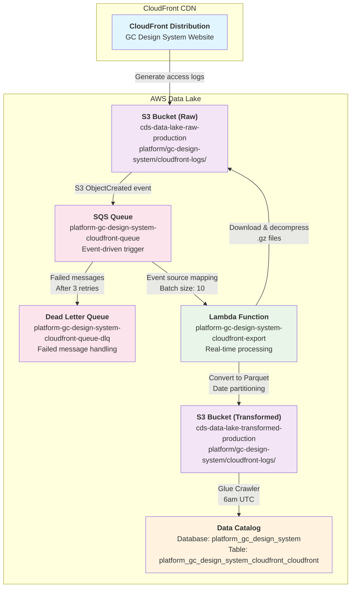

# Platform / GC Design System / CloudFront

* `Schedule`: Event-driven (real-    subgraph aws_datalake[AWS Data Lake]
        CloudFr**Transform Steps**:
1. **Event Detection**: S3 ObjectCreated events trigger SQS messages when new log files are uploaded
2. **Batch Processing**: SQS event source mapping triggers Lambda with batches of up to 10 messages
3. **File Processing**: Lambda downloads and decompresses each `.gz` file individually
4. **Data Parsing**: Tab-separated log entries are parsed into structured records
5. **Date Partitioning**: Records are grouped by date for efficient querying
6. **Format Conversion**: Raw text logs are converted to optimized Parquet format
7. **Metadata Addition**: Processing timestamp and source filename are added to each record
8. **Schema Discovery**: Glue crawler runs daily at 6:00 AM UTC to discover and update table schema|Generate access logs|RawS3
        RawS3 --> |S3 ObjectCreated event|SQS
        SQS --> |Event source mapping<br/>Batch size: 10|Lambda
        SQS --> |Failed messages<br/>After 3 retries|DLQ
        Lambda --> |Download & decompress<br/>.gz files|RawS3
        Lambda --> |Convert to Parquet<br/>Date partitioning|TransS3
        Crawler --> |Daily schedule<br/>6am UTC|CatalogTransformed
        TransS3 --> |Schema discovery|Crawler
    endsing when logs are uploaded)
* `Steward`: GC Design System
* `Contact`: Slack channel #ds-cds-internal

## Description

The GC Design System CloudFront dataset contains access logs from the CloudFront distribution serving the Government of Canada Design System. This dataset provides comprehensive web analytics data including request patterns, geographic distribution, performance metrics, and error rates for the design system website.

The data is processed in real-time using an event-driven architecture. When CloudFront logs are uploaded to S3, they immediately trigger processing through SQS and Lambda, converting the raw compressed log files into optimized Parquet format for efficient querying.

```sql
-- View recent CloudFront requests
SELECT 
    date,
    time,
    "c-ip" as client_ip,
    "cs-method" as method,
    "cs-uri-stem" as uri,
    "sc-status" as status,
    "sc-bytes" as bytes_sent
FROM 
    "platform_gc_design_system"."platform_gc_design_system_cloudfront_cloudfront" 
WHERE date >= current_date - interval '7' day
ORDER BY date DESC, time DESC
LIMIT 100;

-- Traffic analysis by edge location
SELECT 
    "x-edge-location" as edge_location,
    COUNT(*) as request_count,
    AVG(CAST("sc-bytes" AS bigint)) as avg_bytes_sent
FROM 
    "platform_gc_design_system"."platform_gc_design_system_cloudfront_cloudfront"
WHERE date >= current_date - interval '30' day
GROUP BY "x-edge-location"
ORDER BY request_count DESC;

-- Error rate monitoring
SELECT 
    date,
    COUNT(*) as total_requests,
    SUM(CASE WHEN "sc-status" >= '400' THEN 1 ELSE 0 END) as error_requests,
    ROUND(SUM(CASE WHEN "sc-status" >= '400' THEN 1 ELSE 0 END) * 100.0 / COUNT(*), 2) as error_rate_percent
FROM 
    "platform_gc_design_system"."platform_gc_design_system_cloudfront_cloudfront"
WHERE date >= current_date - interval '7' day
GROUP BY date
ORDER BY date;
```

## Data pipeline

The pipeline uses an event-driven architecture with SQS and Lambda to process CloudFront access logs in real-time, providing immediate insights into website traffic patterns.



## Technical Details

### Source data

CloudFront access logs are generated automatically by AWS CloudFront when serving the GC Design System website. These logs contain detailed information about every request made to the CDN including:

- **Source System**: AWS CloudFront Distribution
- **Log Format**: Standard CloudFront access log format (tab-separated values)
- **File Format**: Gzip-compressed (.gz) files

The logs include standard CloudFront fields such as date, time, edge location, client IP, HTTP method, URI, status code, bytes sent, referrer, user agent, and more.

### Extract, Transform and Load (ETL) Jobs

The CloudFront log processing uses an event-driven ETL approach:

**Source Dataset**: 
- CloudFront access logs in `.gz` format stored in `s3://cds-data-lake-raw-production/platform/gc-design-system/cloudfront-logs/`

**Transform Steps**:
1. **Event Detection**: S3 ObjectCreated events trigger SQS messages when new log files are uploaded
2. **Batch Processing**: SQS event source mapping triggers Lambda
3. **File Processing**: Lambda downloads and decompresses each `.gz` file individually
4. **Data Parsing**: Tab-separated log entries are parsed into structured records
5. **Date Partitioning**: Records are grouped by date for efficient querying
6. **Format Conversion**: Raw text logs are converted to optimized Parquet format
7. **Metadata Addition**: Processing timestamp and source filename are added to each record

**Target Dataset**: 
- Parquet files with daily partitioning in `s3://cds-data-lake-transformed-production/platform/gc-design-system/cloudfront-logs/date=YYYY-MM-DD/`

**Run Frequency**: 
- Real-time processing triggered by S3 events

### Infrastructure Components

#### SQS Queue Configuration
- **Queue Name**: `platform-gc-design-system-cloudfront-queue`
- **Message Retention**: 14 days
- **Visibility Timeout**: 16 minutes (longer than Lambda timeout)
- **Dead Letter Queue**: `platform-gc-design-system-cloudfront-queue-dlq`
- **Max Receive Count**: 3 attempts before moving to DLQ
- **Event Source Mapping**: Batch size of 50 messages

#### Lambda Function
- **Name**: `platform-gc-design-system-cloudfront-export`
- **Runtime**: Python 3.13 on ARM64 architecture
- **Memory**: 1024 MB
- **Timeout**: 15 minutes
- **Environment Variables**:
  - `S3_BUCKET_RAW`: Source bucket for CloudFront logs
  - `S3_BUCKET_TRANSFORMED`: Target bucket for processed data
  - `S3_PREFIX_RAW`: Raw data path prefix
  - `S3_PREFIX_TRANSFORMED`: Transformed data path prefix

#### IAM Permissions
- **S3 Read Access**: `s3:GetObject` on raw bucket CloudFront logs path
- **S3 Write Access**: `s3:PutObject` on transformed bucket
- **SQS Permissions**: Managed automatically by event source mapping
- **CloudWatch Logs**: Write access for function logging

#### Glue Crawler
- **Name**: `Platform / GC Design System / CloudFront`
- **Database**: `platform_gc_design_system`
- **Target Table**: `platform_gc_design_system_cloudfront_cloudfront`
- **Data Source**: `s3://cds-data-lake-transformed-production/platform/gc-design-system/cloudfront-logs/`
- **Schedule**: Daily at 6:00 AM UTC (Production only)
- **Schema Detection**: Automatic detection of Parquet schema and partitions


### Deployment

#### Prerequisites
1. Terragrunt infrastructure deployed for export components
2. Lambda function ECR repository created
3. S3 bucket notifications configured for CloudFront logs
4. SQS queue and dead letter queue provisioned

#### Docker Image Build
```bash
cd export/platform/gc_design_system/cloudfront
make docker
```

#### Infrastructure Deployment
```bash
# Staging environment
cd terragrunt/env/staging/export
AWS_PROFILE=datalake-staging-admin terragrunt apply

# Production environment  
cd terragrunt/env/production/export
AWS_PROFILE=datalake-prod-admin terragrunt apply
```

### Monitoring & Troubleshooting

#### CloudWatch Metrics
- **Lambda Metrics**: Invocation count, duration, error rate, concurrent executions
- **SQS Metrics**: Messages visible, messages in flight, message age
- **Dead Letter Queue**: Failed message count and content analysis

#### Error Handling
- **SQS Dead Letter Queue**: Messages that fail processing after 3 attempts
- **Individual File Processing**: Failed files don't prevent batch processing continuation
- **Automatic Retry Logic**: Built-in SQS retry mechanism with exponential backoff
- **Message Deletion**: Successful processing automatically removes messages from queue

#### Common Issues
1. **High Error Rates**: Check dead letter queue for failed messages and error patterns
2. **Processing Delays**: Monitor SQS queue depth and Lambda concurrent executions
3. **Schema Changes**: Verify Glue crawler runs successfully after data format changes
4. **Permission Issues**: Validate IAM policies for S3 and SQS access

#### Log Analysis
- **CloudWatch Logs**: `/aws/lambda/platform-gc-design-system-cloudfront-export`
- **SQS Monitoring**: Queue depth, message processing rates, error rates
- **Dead Letter Queue Analysis**: Failed message patterns and retry analysis
