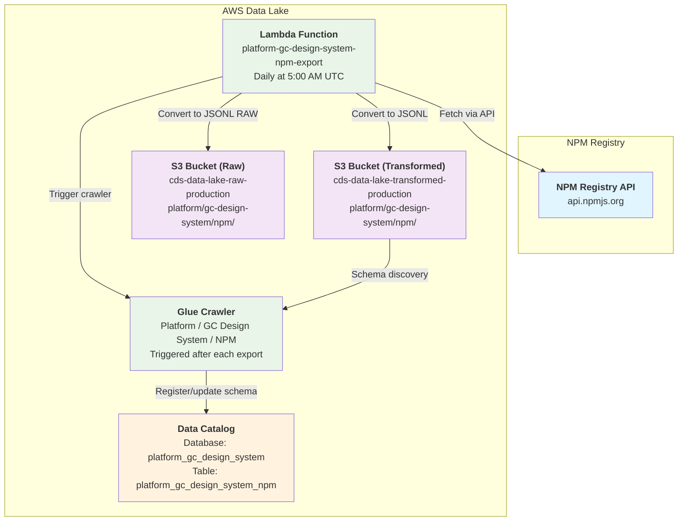

# Platform / GC Design System / NPM

* `Schedule`: Daily at 5:00 AM UTC (Production only)
* `Steward`: GC Design System
* `Contact`: Slack channel #ds-cds-internal

## Description

The GC Design System NPM dataset contains download statistics for the `@cdssnc/gcds-components-vue` NPM package in [JSONL format](https://jsonlines.org/). This dataset provides insights into package adoption and usage trends across the Government of Canada ecosystem.

The data is exported daily from the NPM Registry API and automatically registered as a queryable table in the data catalog. It can be queried in Athena as follows:

```sql
-- View recent download statistics
SELECT 
    day, downloads, package
FROM 
    "platform_gc_design_system"."platform_gc_design_system_npm" 
WHERE year = 2024
ORDER BY day DESC
LIMIT 10;

-- Count total download days tracked
SELECT 
    COUNT(*) as total_days,
    SUM(downloads) as total_downloads
FROM 
    "platform_gc_design_system"."platform_gc_design_system_npm";

-- View table structure
DESCRIBE "platform_gc_design_system"."platform_gc_design_system_npm";
```

## Data pipeline

The pipeline uses a scheduled Lambda function to extract download statistics from the NPM Registry API and automatically register it for querying in Athena.



## Technical Details

### Data Source
- **Source System**: NPM Registry API
- **API Endpoint**: `https://api.npmjs.org/downloads/range/{start}:{end}/@cdssnc/gcds-components-vue`
- **Package**: `@cdssnc/gcds-components-vue`
- **Data Range**: 2024 to current year (yearly requests due to API limitations)

### Export Process
1. **Scheduled Trigger**: CloudWatch Events rule triggers Lambda daily at 5:00 AM UTC (Production only)
2. **Data Extraction**: Lambda function fetches download statistics with yearly API calls (2024 to current year)
3. **Data Enhancement**: Raw download data is enhanced with metadata (package name, year, fetch timestamp)
4. **Data Transformation**: Records are converted to JSONL format for efficient querying
5. **Storage**: Data is uploaded to both raw and transformed S3 buckets under `platform/gc-design-system/npm/`
6. **Schema Registration**: Glue crawler is automatically triggered to update the table schema in the data catalog

### Infrastructure Components

#### Lambda Function
- **Name**: `platform-gc-design-system-npm-export`
- **Runtime**: Python 3.13 (ARM64 architecture)
- **Timeout**: 300 seconds (5 minutes)
- **Memory**: Default
- **Environment Variables**:
  - `S3_BUCKET_NAME`: Target S3 bucket name for transformed data
  - `S3_RAW_BUCKET_NAME`: Target S3 bucket name for raw data
  - `S3_OBJECT_PREFIX`: S3 path prefix for data files
  - `GLUE_CRAWLER_NAME`: Name of Glue crawler to trigger

#### IAM Permissions
- **S3**: Write access to both raw and transformed bucket paths
- **Glue**: Start and monitor crawler execution
- **CloudWatch Logs**: Write access for logging

#### Glue Crawler
- **Name**: `platform-gc-design-system-npm-crawler`
- **Target**: S3 path in transformed bucket
- **Database**: `platform_gc_design_system`
- **Table Name**: `platform_gc_design_system_npm`
- **Schedule**: Triggered by Lambda after each data export
- **Schema Policy**: Update schema changes, merge new columns

### Data Format
- **File Format**: JSONL (JSON Lines)
- **Compression**: None
- **Partitioning**: By year for efficient time-based queries
- **Update Frequency**: Daily (overwrites previous data with complete dataset)

### Data Schema
```json
{
  "day": "2024-01-01",
  "downloads": 150,
  "package": "@cdssnc/gcds-components-vue",
  "year": 2024,
  "fetched_at": "2024-08-13T05:00:00.000Z"
}
```

### Monitoring
- **CloudWatch Logs**: Lambda execution logs available in `/aws/lambda/platform-gc-design-system-npm-export`
- **Glue Crawler Logs**: Available in CloudWatch under `/aws-glue/crawlers`
- **Failure Notifications**: Configured through existing alarm infrastructure

## Access and Permissions

- **Data Location**: S3 bucket `cds-data-lake-transformed-production`
- **Query Access**: Available through AWS Athena
- **Visualization**: Can be connected to Apache Superset for dashboards
- **API Access**: Raw data available via NPM Registry API (public, no authentication required)

## Troubleshooting

### Common Issues
1. **NPM API Rate Limits**: Function includes error handling for API failures and rate limiting
2. **Date Range Validation**: Lambda automatically adjusts end dates for current year to avoid future dates
3. **Schema Changes**: Crawler automatically detects schema changes, but manual intervention may be needed for major structural changes
4. **Data Gaps**: Missing days may indicate no downloads or temporary NPM API issues

### Support
For issues with this pipeline, contact the Platform Core Services team via the #platform-core-services Slack channel.
