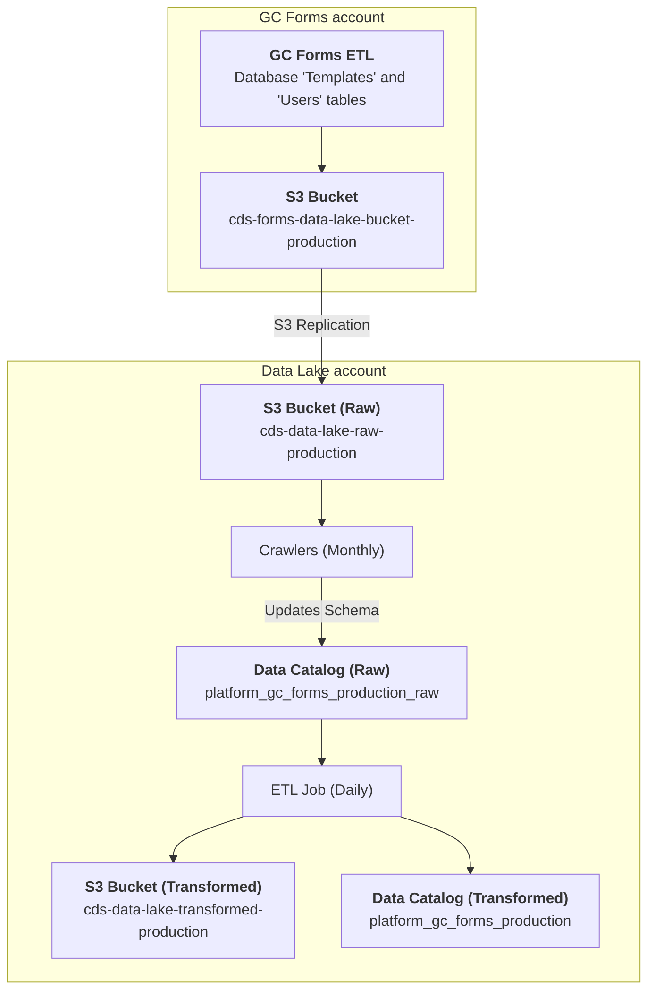

# Platform / GC Forms / Templates
## Description
The GC Forms `Templates` dataset provides information on form templates, and the users that created them, in [Parquet format](https://parquet.apache.org/). The role of the form template is to control how the rendered form is presented to users for submission.

There are no form submissions as part of this dataset and only the form creator's name and Government of Canada email address is available in the users table. The data is partitioned by month, and updated daily.  It can be queried in Superset as follows:

```sql
-- Forms users that have created a template
SELECT 
    * 
FROM 
    "platform_gc_forms_production"."platform_gc_forms_user" 
LIMIT 10;

-- Forms templates
SELECT 
    * 
FROM 
    "platform_gc_forms_production"."platform_gc_forms_template" 
LIMIT 10;

-- Mapping of users to their templates
SELECT 
    * 
FROM 
    "platform_gc_forms_production"."platform_gc_forms_templatetouser" 
LIMIT 10;
```

---

[:information_source:  View the data catalog](../../../catalog/platform/gc-forms/templates.md)

## Data pipeline
A high level view is shown below with more details about each step following the diagram.



### Source data
The source of this dataset is the GC Forms database's `Templates` and `Users` tables.  [A nightly ETL job](https://github.com/cds-snc/forms-terraform/blob/main/aws/glue/jobs.tf) runs in the `Forms-Production` AWS account that extracts, transforms and loads data into an S3 bucket.  An [S3 replication rule](https://github.com/cds-snc/forms-terraform/blob/main/aws/glue/s3.tf#L1-L13) then handles moving this data into the Data Lake's Raw bucket.
```
cds-data-lake-raw-production/platform/gc-forms/processed-data/template/*.parquet
cds-data-lake-raw-production/platform/gc-forms/processed-data/templateToUser/*.parquet
cds-data-lake-raw-production/platform/gc-forms/processed-data/user/*.parquet
```

### Crawlers
On the first of each month, an AWS Glue crawler runs in the `DataLake-Production` AWS account to identify schema changes and update the Glue data catalog:

- [Platform / GC Forms / Templates](https://github.com/cds-snc/data-lake/blob/b096d7f2b88aba91a0cb1d8e16985c5b1c42a01a/terragrunt/aws/glue/crawlers.tf#L24-L49)

This crawler creates and manages the following data catalog table in the [`platform_gc_forms_production_raw` database](https://github.com/cds-snc/data-lake/blob/b096d7f2b88aba91a0cb1d8e16985c5b1c42a01a/terragrunt/aws/glue/databases.tf#L6-L9):

- `platform_gc_forms_raw_template`: GC Forms template data.
- `platform_gc_forms_raw_templatetouser`: mapping for templates to the users that created them.
- `platform_gc_forms_raw_user`: GC Forms users that have created a template.

### Extract, Transform and Load (ETL) Jobs

Each day, the `Platform / GC Forms / Templates` Glue ETL job runs and updates existing data as well as adding new data.  The resulting dataset is saved in the Data Lake's Transformed `cds-data-lake-transformed-production` S3 bucket:

```
cds-data-lake-transformed-production/platform/gc-forms/processed-data/template/month=YYYY-MM/*.parquet
cds-data-lake-transformed-production/platform/gc-forms/processed-data/templateToUser/month=YYYY-MM/*.parquet
cds-data-lake-transformed-production/platform/gc-forms/processed-data/user/month=YYYY-MM/*.parquet
```

Additionally, a data catalog table is created in the [`platform_gc_forms_production` database](https://github.com/cds-snc/data-lake/blob/b096d7f2b88aba91a0cb1d8e16985c5b1c42a01a/terragrunt/aws/glue/databases.tf#L1-L4):

- `platform_gc_forms_template`: deduplicated GC Forms template data.
- `platform_gc_forms_templatetouser`: deduplicated mapping for templates to the users that created them.
- `platform_gc_forms_user`: deduplicated GC Forms users that have created a template.
