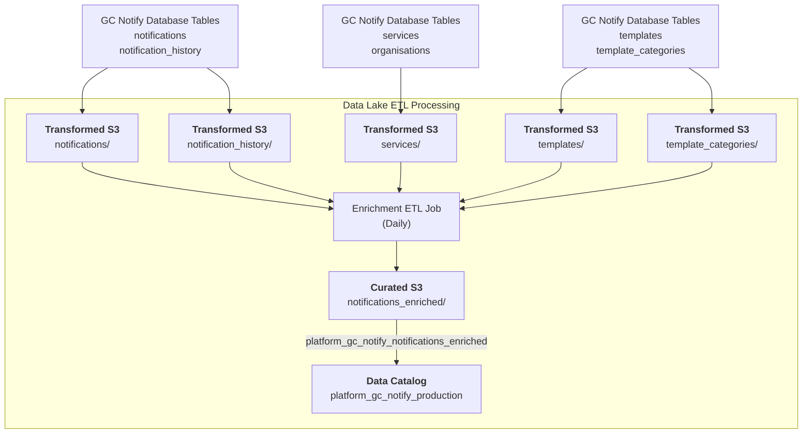

# Platform / GC Notify / Enriched Notifications

* `Schedule`: Daily
* `Steward`: Platform Core Services
* `Contact`: Slack channel #platform-core-services

## Description

The GC Notify Enriched Notifications pipeline takes raw notification events and enriches them with service and template context data. This produces a denormalized, analysis-ready dataset that combines notification details, service information, template metadata, and organization context into a single table.

The pipeline processes both current notifications (from the `notifications` table) and historical notifications (from the `notification_history` table) to create a comprehensive view of all notification events.

This data pipeline creates one Glue data catalog table in the `platform_gc_notify_production` database:
- `platform_gc_notify_notifications_enriched`: Enriched notification events with service and template context

The data can be queried in Superset as follows:

```sql
-- Enriched notifications
SELECT 
    * 
FROM 
    "platform_gc_notify_production"."platform_gc_notify_notifications_enriched" 
LIMIT 10;
```

---

[:information_source: View the data catalog](../../../catalog/platform/gc-notify/enriched.md)

## Data pipeline

A high level view is shown below with more details about each step following the diagram.



### Source data

The enrichment pipeline uses data from the transformed GC Notify tables:

- **Notifications**: Current notification events within retention period
- **Notification History**: Historical record of all past notification events
- **Services**: Service metadata including name, limits, organization
- **Templates**: Template definitions with version and category
- **Template Categories**: Category-level metadata including sending vehicle and process type

These tables are sourced from the daily GC Notify export process and are available in the `platform_gc_notify_production` database in Glue Data Catalog.

### Extract, Transform and Load (ETL) Jobs

Each day, the `Platform / GC Notify / Enriched` Glue ETL job runs and produces enriched notification data:

**Source datasets:**
- `platform_gc_notify_production.platform_gc_notify_notifications` (current month and previous month)
- `platform_gc_notify_production.platform_gc_notify_notification_history` (current month and previous month)
- `platform_gc_notify_production.platform_gc_notify_services` (latest snapshot)
- `platform_gc_notify_production.platform_gc_notify_templates` (latest snapshot)
- `platform_gc_notify_production.platform_gc_notify_template_categories` (latest snapshot)

**Transform steps:**

1. **Union Notifications**: Combines current `notifications` and historical `notification_history` data for the processing period
2. **Join Services**: Joins notification data with service information to add service context
   - Adds service name, limits, active status, and organization details
   - Includes organization name through a left join to the organisations table
3. **Join Templates**: Joins enriched data with template information
   - Adds template name, version, category information
   - Includes template category metadata (English/French names, process types, SMS vehicle)
4. **Create Denormalized View**: Produces a flat table with all notification, service, and template fields
5. **Partition by Date**: Applies year and month partitioning for efficient querying

**Target dataset:**
The transformed data is saved in the data lake's Curated `cds-data-lake-transformed-production` S3 bucket:

```
cds-data-lake-transformed-production/platform/gc-notify/notifications_enriched/year=YYYY/month=YYYY-MM/*.parquet
```

Additionally, a data catalog table is created in the `platform_gc_notify_production` database:

- `platform_gc_notify_notifications_enriched`: Denormalized view of notifications with complete service and template context, available for analysis in Superset

**Processing Window**: By default, the job processes the current month and previous month to ensure that any late-arriving data or service/template updates are reflected in the enriched view. This can be overridden with `start_month` and `end_month` parameters.

**Date Range Parameters**: The job accepts optional command-line parameters:
- `start_month`: Start month in YYYY-MM format (defaults to previous month)
- `end_month`: End month in YYYY-MM format (defaults to current month)

**Run frequency:** Daily to capture the latest notification events and service/template updates

