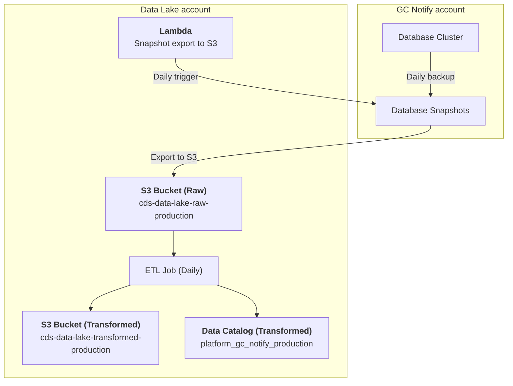

# Platform / GC Notify

## Description
The GC Notify dataset is an export of the following database tables in [Parquet format](https://parquet.apache.org/):

- `jobs`: Batch jobs for email and SMS notification sending
- `login_events`: Records of user login activity
- `notification_history`: Historical record of all notifications
- `notifications`: Core table containing email and SMS notifications within their service's retention period
- `organisation`: Organizations that use GC Notify
- `permissions`: User permissions granted within a service
- `services`: Notification services used to send communications
- `services_history`: Historical record of changes made to notification services
- `template_categories`: Categories for organizing notification templates
- `templates`: Email and SMS templates used for sending notifications
- `templates_history`: Historical record of changes made to notification templates
- `user_to_organisation`: Mapping between users and their organizations
- `user_to_service`: Mapping between users and their services
- `users`: Users accounts within the system

There is no personally identifiable information (PII) included in this dataset. The data is updated daily and partitioned by year and month using the `created_at` date.  It can be queried in Superset as follows:

```sql
-- Jobs
SELECT 
    * 
FROM 
    "platform_gc_notify_production"."platform_gc_notify_jobs" 
LIMIT 10;

-- Login Events
SELECT 
    * 
FROM 
    "platform_gc_notify_production"."platform_gc_notify_login_events" 
LIMIT 10;

-- Notification History
SELECT 
    * 
FROM 
    "platform_gc_notify_production"."platform_gc_notify_notification_history" 
LIMIT 10;

-- Notifications
SELECT 
    * 
FROM 
    "platform_gc_notify_production"."platform_gc_notify_notifications" 
LIMIT 10;

-- Organisation
SELECT 
    * 
FROM 
    "platform_gc_notify_production"."platform_gc_notify_organisation" 
LIMIT 10;

-- Permissions
SELECT 
    * 
FROM 
    "platform_gc_notify_production"."platform_gc_notify_permissions" 
LIMIT 10;

-- Services
SELECT 
    * 
FROM 
    "platform_gc_notify_production"."platform_gc_notify_services" 
LIMIT 10;

-- Services History
SELECT 
    * 
FROM 
    "platform_gc_notify_production"."platform_gc_notify_services_history" 
LIMIT 10;

-- Template Categories
SELECT 
    * 
FROM 
    "platform_gc_notify_production"."platform_gc_notify_template_categories" 
LIMIT 10;

-- Templates
SELECT 
    * 
FROM 
    "platform_gc_notify_production"."platform_gc_notify_templates" 
LIMIT 10;

-- Templates History
SELECT 
    * 
FROM 
    "platform_gc_notify_production"."platform_gc_notify_templates_history" 
LIMIT 10;

-- User to Organisation
SELECT 
    * 
FROM 
    "platform_gc_notify_production"."platform_gc_notify_user_to_organisation" 
LIMIT 10;

-- User to Service
SELECT 
    * 
FROM 
    "platform_gc_notify_production"."platform_gc_notify_user_to_service" 
LIMIT 10;

-- Users
SELECT 
    * 
FROM 
    "platform_gc_notify_production"."platform_gc_notify_users" 
LIMIT 10;
```

---

[:information_source:  View the data catalog](../../../catalog/platform/gc-notify/export.md)

## Data pipeline
A high level view is shown below with more details about each step following the diagram.



### Source data
The source of this dataset is the GC Notify database tables.  To avoid any database performance impact, the data is taken from the daily database snapshots (backups) created by the Notify team.  [A Lambda function](https://github.com/cds-snc/data-lake/tree/318387c230a3ec2b271492129b8066289e7160b3/export/platform/gc_notify) runs on a daily schedule to trigger this export of the database snapshot to the Raw S3 bucket.

```
cds-data-lake-raw-production/platform/gc-notify/notification-canada-ca-production-cluster-YYYY-MM-DD/NotificationCanadaCaproduction/public.jobs/1/*.parquet
cds-data-lake-raw-production/platform/gc-notify/notification-canada-ca-production-cluster-YYYY-MM-DD/NotificationCanadaCaproduction/public.login_events/1/*.parquet
cds-data-lake-raw-production/platform/gc-notify/notification-canada-ca-production-cluster-YYYY-MM-DD/NotificationCanadaCaproduction/public.notification_history/1/*.parquet
cds-data-lake-raw-production/platform/gc-notify/notification-canada-ca-production-cluster-YYYY-MM-DD/NotificationCanadaCaproduction/public.notifications/1/*.parquet
cds-data-lake-raw-production/platform/gc-notify/notification-canada-ca-production-cluster-YYYY-MM-DD/NotificationCanadaCaproduction/public.organisation/1/*.parquet
cds-data-lake-raw-production/platform/gc-notify/notification-canada-ca-production-cluster-YYYY-MM-DD/NotificationCanadaCaproduction/public.permissions/1/*.parquet
cds-data-lake-raw-production/platform/gc-notify/notification-canada-ca-production-cluster-YYYY-MM-DD/NotificationCanadaCaproduction/public.services/1/*.parquet
cds-data-lake-raw-production/platform/gc-notify/notification-canada-ca-production-cluster-YYYY-MM-DD/NotificationCanadaCaproduction/public.services_history/1/*.parquet
cds-data-lake-raw-production/platform/gc-notify/notification-canada-ca-production-cluster-YYYY-MM-DD/NotificationCanadaCaproduction/public.template_categories/1/*.parquet
cds-data-lake-raw-production/platform/gc-notify/notification-canada-ca-production-cluster-YYYY-MM-DD/NotificationCanadaCaproduction/public.templates/1/*.parquet
cds-data-lake-raw-production/platform/gc-notify/notification-canada-ca-production-cluster-YYYY-MM-DD/NotificationCanadaCaproduction/public.templates_history/1/*.parquet
cds-data-lake-raw-production/platform/gc-notify/notification-canada-ca-production-cluster-YYYY-MM-DD/NotificationCanadaCaproduction/public.user_to_organisation/1/*.parquet
cds-data-lake-raw-production/platform/gc-notify/notification-canada-ca-production-cluster-YYYY-MM-DD/NotificationCanadaCaproduction/public.user_to_service/1/*.parquet
cds-data-lake-raw-production/platform/gc-notify/notification-canada-ca-production-cluster-YYYY-MM-DD/NotificationCanadaCaproduction/public.users/1/*.parquet
```

### Extract, Transform and Load (ETL) Jobs

Each day, the `Platform / GC Notify` Glue ETL job runs and updates existing data as well as adding new data. The resulting dataset is saved in the Data Lake's Transformed `cds-data-lake-transformed-production` S3 bucket:

```
cds-data-lake-transformed-production/platform/gc-notify/jobs/year=YYYY/month=YYYY-MM/*.parquet
cds-data-lake-transformed-production/platform/gc-notify/login_events/year=YYYY/month=YYYY-MM/*.parquet
cds-data-lake-transformed-production/platform/gc-notify/notification_history/year=YYYY/month=YYYY-MM/*.parquet
cds-data-lake-transformed-production/platform/gc-notify/notifications/year=YYYY/month=YYYY-MM/*.parquet
cds-data-lake-transformed-production/platform/gc-notify/organisation/year=YYYY/month=YYYY-MM/*.parquet
cds-data-lake-transformed-production/platform/gc-notify/permissions/year=YYYY/month=YYYY-MM/*.parquet
cds-data-lake-transformed-production/platform/gc-notify/services/year=YYYY/month=YYYY-MM/*.parquet
cds-data-lake-transformed-production/platform/gc-notify/services_history/year=YYYY/month=YYYY-MM/*.parquet
cds-data-lake-transformed-production/platform/gc-notify/template_categories/year=YYYY/month=YYYY-MM/*.parquet
cds-data-lake-transformed-production/platform/gc-notify/templates/year=YYYY/month=YYYY-MM/*.parquet
cds-data-lake-transformed-production/platform/gc-notify/templates_history/year=YYYY/month=YYYY-MM/*.parquet
cds-data-lake-transformed-production/platform/gc-notify/user_to_organisation/year=YYYY/month=YYYY-MM/*.parquet
cds-data-lake-transformed-production/platform/gc-notify/user_to_service/year=YYYY/month=YYYY-MM/*.parquet
cds-data-lake-transformed-production/platform/gc-notify/users/year=YYYY/month=YYYY-MM/*.parquet
```

Additionally, data catalog tables are created in the [`platform_gc_notify_production` database](https://github.com/cds-snc/data-lake/blob/318387c230a3ec2b271492129b8066289e7160b3/terragrunt/aws/glue/databases.tf#L11-L14):

- `platform_gc_notify_jobs`: Batch jobs for email and SMS notification sending
- `platform_gc_notify_login_events`: Records of user login activity
- `platform_gc_notify_notification_history`: Historical record of all notifications
- `platform_gc_notify_notifications`: Core table containing email and SMS notifications within their service's retention period
- `platform_gc_notify_organisation`: Organizations that use GC Notify
- `platform_gc_notify_permissions`: User permissions granted within a service
- `platform_gc_notify_services`: Notification services used to send communications
- `platform_gc_notify_services_history`: Historical record of changes made to notification services
- `platform_gc_notify_template_categories`: Categories for organizing notification templates
- `platform_gc_notify_templates`: Email and SMS templates used for sending notifications
- `platform_gc_notify_templates_history`: Historical record of changes made to notification templates
- `platform_gc_notify_user_to_organisation`: Mapping between users and their organizations
- `platform_gc_notify_user_to_service`: Mapping between users and their services
- `platform_gc_notify_users`: Users accounts within the system
