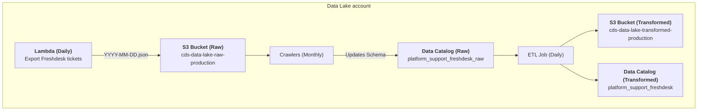

# Platform / Support / Freshdesk

* `Schedule`: Daily
* `Steward`: Platform Core Services
* `Contact`: Slack channel #platform-core-services

## Description
The [Freshdesk](https://www.freshworks.com/freshdesk/) dataset provides information on user support tickets in [Parquet format](https://parquet.apache.org/). All user entered information and personally identifiable information (PII) has been removed from the dataset. The data is partitioned by month, and updated daily.

This data pipeline creates the Glue data catalog table `platform_support_freshdesk` in the `platform_support_production` database.  It can be queried in Superset as follows:

```sql
SELECT 
    * 
FROM 
    "platform_support_production"."platform_support_freshdesk" 
LIMIT 10;
```

---

[:information_source:  View the data catalog](../../../catalog/platform/support/freshdesk.md)

## Data pipeline
A high level view is shown below with more details about each step following the diagram.



### Source data
The [Freshdesk data export](https://github.com/cds-snc/data-lake/tree/6d3aea78d5d5a47d318ca66d37f0d4af6972fca4/export/platform/support/freshdesk) is run in the `DataLake-Production` account's [ `platform-support-freshdesk-export` Lambda function](https://github.com/cds-snc/data-lake/tree/6d3aea78d5d5a47d318ca66d37f0d4af6972fca4/terragrunt/aws/export/platform/support/freshdesk) that is triggered each day.  On each run it saves any updated tickets from the previous day to the Raw S3 bucket in a `YYYY-MM-DD.json` file:

```
cds-data-lake-raw-production/platform/support/freshdesk/month=YYYY-MM/YYYY-MM-DD.json
```

### Crawlers
On the first of each month, an AWS Glue crawler runs in the `DataLake-Production` AWS account to identify schema changes and update the Glue data catalog:

- [Platform / Support / Freshdesk](https://github.com/cds-snc/data-lake/blob/6d3aea78d5d5a47d318ca66d37f0d4af6972fca4/terragrunt/aws/glue/crawlers.tf#L49-L79)

This crawler creates and manages the following data catalog table in the [`platform_support_production_raw` database](https://github.com/cds-snc/data-lake/blob/6d3aea78d5d5a47d318ca66d37f0d4af6972fca4/terragrunt/aws/glue/databases.tf#L11-L14):

- `platform_support_freshdesk`: Freshdesk ticket data with no PII or user entered information.

### Extract, Transform and Load (ETL) Jobs

Each day, the [`Platform / Support / Freshdesk` Glue ETL job](https://github.com/cds-snc/data-lake/blob/6d3aea78d5d5a47d318ca66d37f0d4af6972fca4/terragrunt/aws/glue/etl.tf#L39-L108) runs and updates existing tickets as well as adding new tickets.  The resulting data is saved in the data lake's Transformed `cds-data-lake-transformed-production` S3 bucket:

```
cds-data-lake-transformed-production/platform/support/freshdesk/month=YYYY-MM/*.parquet
```

Additionally, a data catalog table is created in the [`platform_support_production` database](https://github.com/cds-snc/data-lake/blob/6d3aea78d5d5a47d318ca66d37f0d4af6972fca4/terragrunt/aws/glue/databases.tf#L6-L9):

- `platform_support_freshdesk`: Freshdesk ticket data with no PII or user entered information.
