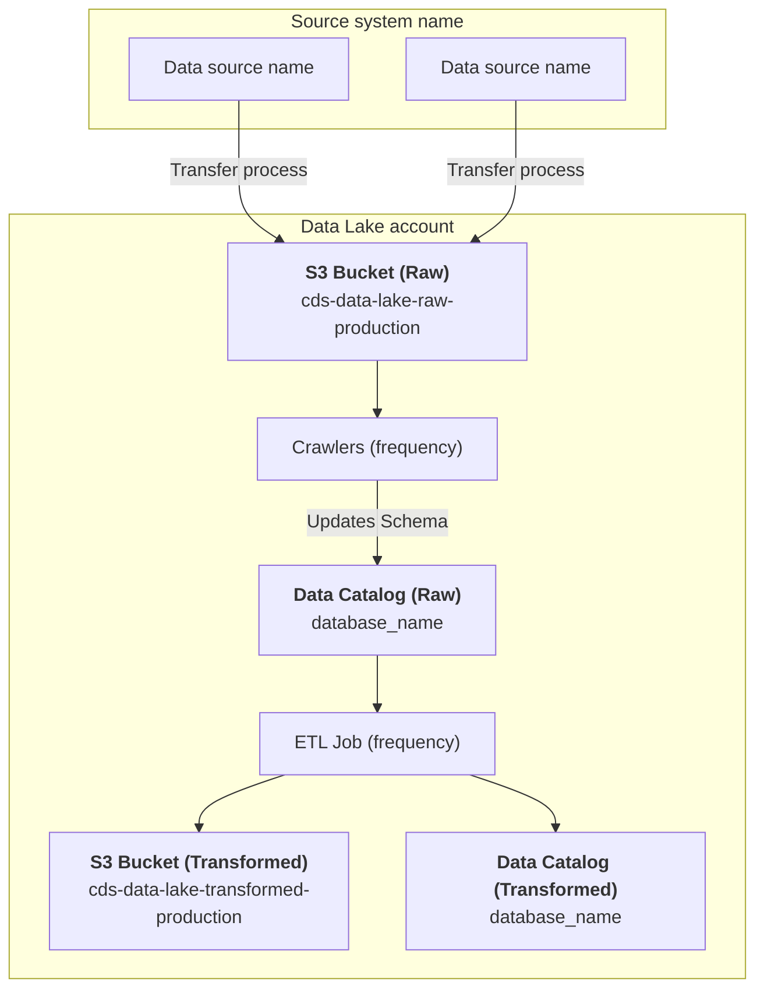

# Dataset name

## Description

A simple description of the dataset explaining what it is. 

If a data catalog doc exists for the pipeline, provide a link to it as well.

## Data pipeline

If possible, provide a high level flow diagram show how the data moves from source system(s) to the data lake.

### Source data

A description of the source data, its origin(s) and owners.

### Crawlers (optional)

Details on how the data's schema is automatically determined.  For some data sources, this will not be required as the data schema will be defined manually.

### Extract, Transform and Load (ETL) Jobs

Provide a description on the ETL jobs, including their:

- source datasets;
- transform steps;
- target datasets; and
- run frequency.
